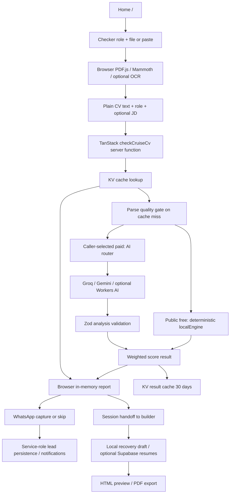

# Current architecture and data flows

Audited 2026-09-22. This describes the working tree, including uncommitted persistence work.



The binary file is parsed in the browser, not uploaded to a storage bucket. The server receives text. Authenticated CV saves use the browser Supabase client directly; there is no server-side ownership service for resumes in this repository. Tenant isolation therefore depends on deployed Postgres RLS, which is not represented by a resumes migration here.

## Important project tree

```text
GET_HIRED_PRODUCT_SPEC.md         product source of truth
AGENTS.md                        session continuity + vexp rules
src/
  routes/                        /, /landing redirect, /builder, /dashboard,
                                 /sign-in, /sign-up, /tools/cruise-cv-checker,
                                 /tools/metrics
  router.tsx                     route tree + error boundary; no QueryClientProvider
  routeTree.gen.ts                generated routing dependency
  components/checker/             score ring, WhatsApp capture, upload progress
  components/builder/             editor, checklist, recovery, preview/style controls
  components/templates/          registry and seven HTML templates
  components/ui/                 active primitives + unused scaffold candidates
  lib/cruise-cv-check.ts          scoring RPC + CRM RPCs (mixed responsibility)
  lib/extractCvText.ts            browser binary-to-text parser
  lib/cvExtractDeterministic.ts   text-to-ResumeData extraction
  lib/localEngine.ts             current public scorer
  lib/cruiseCvRubric.ts           score contracts, weights, legacy parser, AI prompt
  lib/cvDeterministicChecks.ts    structural checks and parse quality gate
  lib/cvFeedback.ts              deterministic recommendations/confidence
  lib/precheck/                  two termbanks + sommelier certification gate
  lib/ai/                        adapters/router/prompts/builder assistance
  lib/parseCvForBuilder.ts        direct import + optional enrichment RPC
  lib/cv-import-handoff.ts        one-shot 30-minute session payload
  lib/resume-{store,persistence}.ts account-aware local/cloud recovery
  lib/pdf/                       independent React PDF layout
  lib/{telemetry,metrics-api,upload-failure-*,kv-cache,clarity}.ts
  data/                          role registry, termbanks, patterns, synonyms
  types/                         resume, formatting, checker audit
  styles.css
supabase/migrations/             only CRM tables; resumes DDL missing
tests/{unit,e2e,fixtures,helpers,__mocks__}/
scripts/build-precheck-termbanks.ts
cabinsteward.json, staffyouth.json  required termbank source inputs
public/                         shipped static assets/manifest
cv-tests/, cv-templates/         PDF references; consent/provenance review needed
cv-journey-artifacts/            tracked generated scores/PDFs; script inputs too
files/                          execution-kit zip + duplicate execution notes
.github/workflows/deploy.yml     automatic main deployment
wrangler*.jsonc, vite.config.ts, package*.json, test/lint/TS configs
docs/{project,sessions,testing}/ current documentation system
```

Ignored node_modules, dist, .wrangler, .tanstack and old .claude/worktrees are generated/local material, not application source. Lint currently enters the old worktrees. See the per-file cleanup ledger for the 376 existing nonignored files.

## Entities and retention

| Entity/location | Actual stored fields/data | Retention/access |
|---|---|---|
| Supabase Auth | User/session identity handled by SDK; no local auth schema | Provider settings unknown; browser persistent auth session |
| resumes | Code expects id, user_id, title, data, template_id, updated_at; data includes candidate PII, photo and optional checkerAudit | DDL/types/grants/RLS/retention unknown; client filters are not authorization |
| gethired_leads | id UUID PK; unique phone; country_code, full_name, email_from_cv, consent/consented_at, role_slug/label, score/tier, top_fixes[], journey_stage, source, wa_me_url, notification/journey timestamps, last_seen/created/updated | CRM migration enables RLS without client policies; server service role bypasses it. No retention/deletion schedule |
| gethired_lead_events | id UUID PK, lead_id FK cascade delete, event text, payload JSONB, created_at | RLS enabled; payload may contain full_name. CRM activity is distinct from general analytics |
| KV check:* | CvScoreResult, keyed by scoring version + role + tier + normalized CV/JD SHA-256 | 30 days, shared across callers; no owner or result schema validation on cache read |
| KV metrics:* | Daily counters, score buckets and last 100 latency samples | 90 days; unauthenticated aggregate read |
| KV upload_failures:* | Up to 200 daily error entries incl. caller message/stack, session ID, file metadata | 90 days; unauthenticated write and raw-entry read |
| localStorage checker-draft-v1 | Raw extracted CV text, role and JD | No expiry; same browser origin users share key |
| sessionStorage handoff | Structured resume, sourceText, audit, role, schemaVersion, timestamps | 30-minute validity checked on consumption; removed then; no timed physical purge |
| localStorage hospitality-resume-v1 and user/resume keys | Anonymous/account structured CV, dirty state, revisions, recovery snapshots | No expiry; account keys prevent accidental mixing but are not protection from another person using the same browser |
| active lead ID | CRM UUID in localStorage | No expiry; must not be treated as authorization |

No analysis table, analysis ID, report-version record, or usefulness-feedback table exists in checked-in schema. Builder checkerAudit is a subset for editing, not a retrievable original report. No server raw-binary persistence found. Raw text *is* retained in browser storage; derived AI report content may contain PII in shared KV. Uploaded photos are data in CV JSON. Git PDF fixtures/exports are another potential personal-data archive; ownership/consent is unknown.

## RPC authorization boundaries

checkCruiseCv validates minimal strings and known role, but accepts tier=paid from callers without entitlement/auth checks; text has no maximum. parseCvForBuilder, enrichImportedCv, checkWritingFn, tailorContentFn are public AI-capable boundaries without application quotas. saveCvLead uses service-role writes and phone lookup; trackLeadJourney updates by caller-supplied UUID without ownership proof. getMetrics and getUploadFailures lack staff authentication. logUploadFailure accepts unbounded diagnostic strings. Framework serialization validation is not domain authorization.

Dashboard delete is by id and relies on RLS. Source cannot prove User A is blocked from reading/updating/deleting User B's resume. This is a release-blocking **verification gap**, not a claimed confirmed production leak. The lead update boundary is demonstrably missing ownership validation in code; do not test it with real people's records.

## User journey and recovery

| Transition | Handler/data | Success | Failure/recovery/state | Analytics |
|---|---|---|---|---|
| Landing → role | index.tsx Link → checker | Role dropdown visible | Global error boundary; no account required | landing/selector events absent |
| Role → upload | handleRoleChange; roleSlug state/localStorage | One of 15 roles | No custom path; old invalid stored role fails server lookup | role events absent |
| File → validation | handleFileChange, 5 MB | File held in memory | Too large toast; old input may remain; choose again | upload_started only after accepted size |
| Validation → parse | extractTextFromFile; File → string | PDF/DOCX/TXT, OCR fallback | Typed extraction errors, toast/paste/retry; no global parser deadline | upload_failed; incomplete parse telemetry |
| Parse → analysis | handleSubmit → checkCruiseCv; cvText/role/JD/free | Cache or deterministic score | Quality-failure union; form retained, explicit reset clears draft | server counters; no canonical start/end |
| Analysis → report | outcome cast; result in React memory, URL step=results | Role, score, two fixes | 35-second client race does not cancel server; reload/back discards report | score_viewed, cv_upload_succeeded |
| Report → detail | WhatsAppCaptureForm success/skip | Reveals categories/keywords | Lead failure silently advances; report otherwise remains | CRM events, not spec engagement |
| Report → builder | saveCvImport + navigate from=import | Local parse/audit/source copied | Session quota failure silent; expired/import read consumes handoff | builder_entered |
| Report → signup/save | No dedicated report action/ID | Not implemented | Navigating to auth loses in-memory report | absent |
| Builder → auth/cloud | useResumeStore/ResumePersistence → Supabase resumes | Local recovery and debounced upsert | Explicit retry/recovery/conflict, improved by pre-existing dirty work | no report_saved event |
| Signup → dashboard | Supabase redirect /dashboard | Intended list | Missing QueryClientProvider crashes; Edit/New also target / | absent |
| Report → feedback | No handler | Missing | No usefulness loop | absent |

## Operational concerns

KV counters are read/modify/write and can lose concurrent increments. Fire-and-forget score/metric writes lack a request lifetime guarantee; use the platform's supported context in a later change ([Workers context](https://developers.cloudflare.com/workers/runtime-apis/context/)). Cache hits omit normal outcome/latency recording. Metrics reader misses score_100 (loops only through 90). No observability configuration appears in Wrangler. None of these measurements should be treated as exact funnel accounting.

Client rendering mostly uses escaped React text. The chart scaffold has dangerouslySetInnerHTML for generated CSS; it is not an active CV rendering sink. No public CV bucket/CORS wildcard handler was found. Session replay masking is an external setting and rendered reports/previews are not explicitly masked in code; verify with [Clarity masking guidance](https://learn.microsoft.com/en-us/clarity/setup-and-installation/clarity-masking). Ownership needs database policies, not UI filtering ([Supabase RLS](https://supabase.com/docs/guides/database/postgres/row-level-security)).
